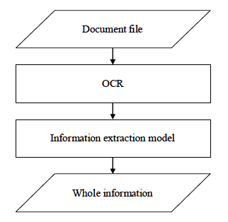
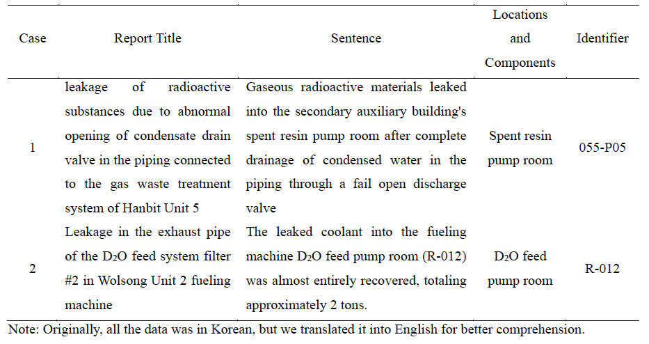

# Information extraction from historical documents for nuclear decommissioning site characterization

## 개요

지능형 원전해체 부지특성평가 통합관리 솔루션 개발 프로젝트에 참여하여, 자연어 처리(NLP) 기술을 이용하여 보고서를 자동으로 분석하고, 과거의 원자력 사고가 발생한 장소를 분류하는 인공지능 모델을 개발하였다.

## 참여기관

연세대학교, (주)미래와도전, (주)한국전력기술

## 기간

2021년 08월 ~ 2023년 12월

## 관련 논문

Byun, H., Park, J. D., An, S., Kim, J., Kim, J., Lee, D. Y., & Lee, B. (2024). Intelligent nuclear decommissioning solution: Code for site characterization and management of overall surveys. *Annals of Nuclear Energy*, *196*, 110212.

## 관련 특허

발명의 명칭: 지능형 원전해체 부지특성평가 통합 관리 시스템 및 방법

등록번호: 10-2528436

## 사용 모델

EasyOCR, Korean Sentence splitter, ko-sroberta-multitask

## 모델 프레임워크

## 출력 예시

